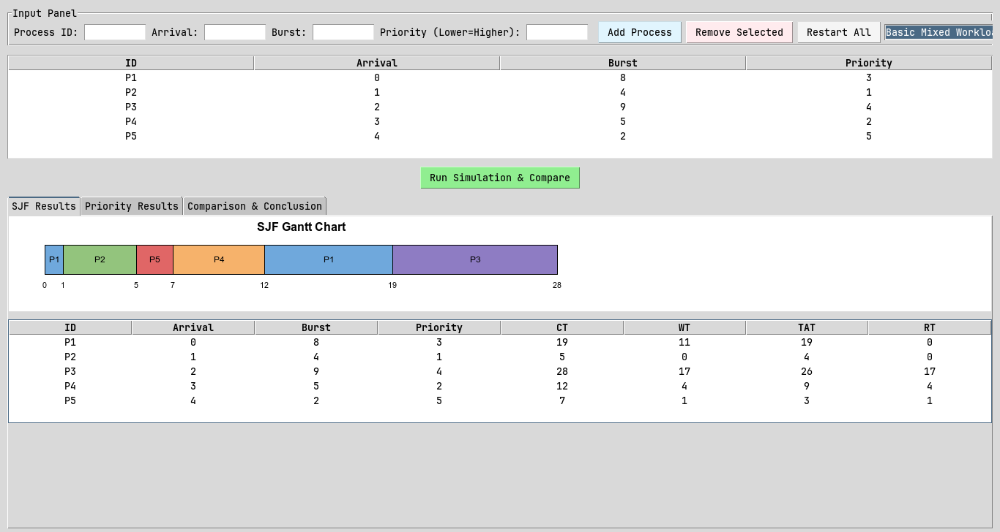
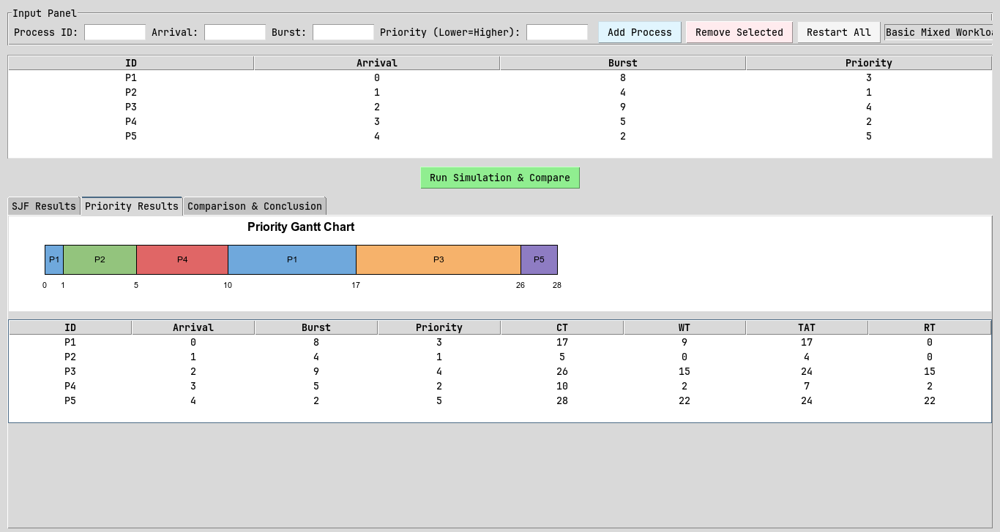
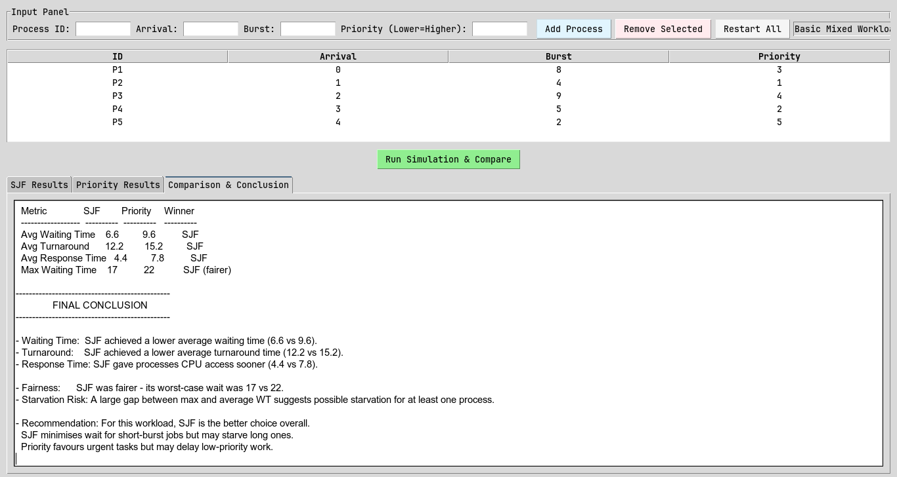

# CPULab

## Description

A CPU scheduling simulator that implements and compares two cpu scheduling algorithms
- Shortest Job First (SJF)
- Priority Scheduling

Both algorithms run on the same workload, It produces Gantt charts and metrics per process (CT, WT, TAT, RT)
also a comparison summary to analyze the trade-offs between scheduling by burst time
versus scheduling by urgency.

- CT      --> Completion Time
- WT      --> Waiting Time
- TAT     --> Turn Around time
- RT      --> Response Time

## Requirements

- Python 3.10+
- No external dependencies

## Instructions to run simulator

```sh
python -m cpulab.main
```


## Documentation

Full project documentation (algorithm explanations, test scenario results
with screenshots, comparison analysis, and conclusion) is available in:

[Documentation here](./docs/SJF_vs_Priority_Documentation.docx)

## Assumptions

- Both algorithms are **preemptive**
- Priority rule: `lower number = higher priority`
- All processes are CPU-bound (no I/O bursts)
- The same workload is used for both algorithms in every scenario


## Screenshots
- SRJ Gantt Chart


- Priority Gantt Chart


- Comparison and Conclusion



## Team members

1. Abdelrahman Ahmed
2. Loaay Waheed
3. Emad Amr
4. Karim Mohamed
5. Moaz Ahmed
6. Ahmed Ibrahim
7. Amr Mohamed
